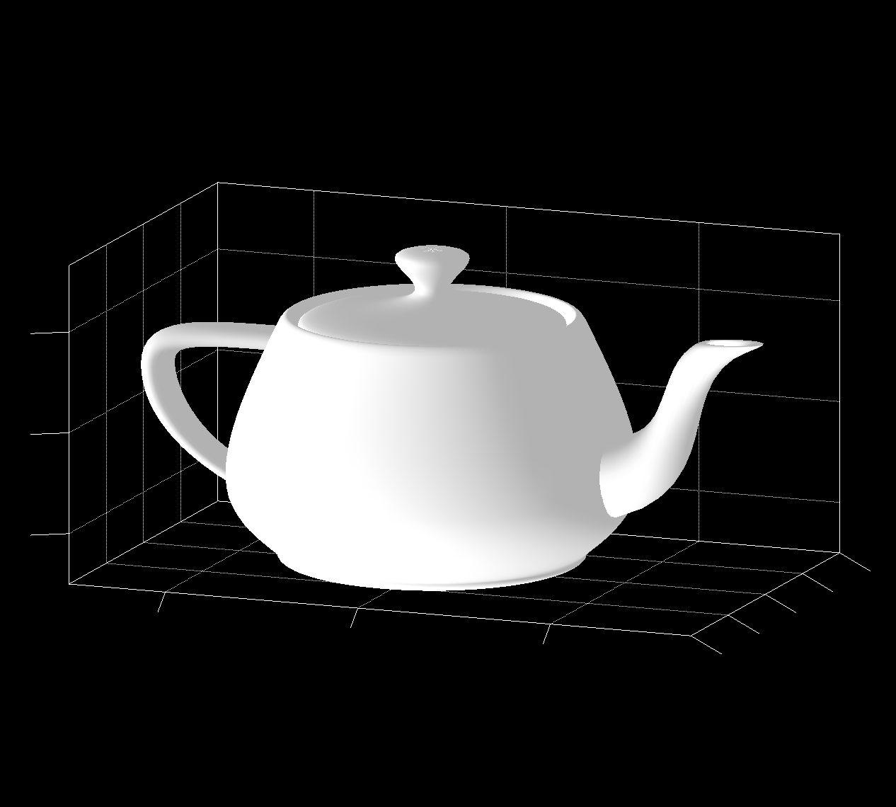

# panama-gl

This project explore Native OpenGL capabilities of Panama Early-Access Release.
JDK 17 incubation comes with [JEP-412 : Foreign Function & Memory API](https://openjdk.java.net/jeps/412) which offers a brand new way of accessing native libraries.

We here show to use Panama as a rendering backend for Jzy3D as a prototype.

### SurfaceDemoPanamaGL


### TeapotDemoPanamaGL



## Run

You need to install [Panama Early-Access build](https://jdk.java.net/panama/).

### Run from IDE

Then run from Intellij ([Eclipse won't work yet](https://github.com/jzy3d/panama-gl/issues/3)) one of these demos
* SurfaceDemoPanamaGL
* TeapotDemoPanamaGL

This will require these VM arguments

```
-XstartOnFirstThread --enable-native-access=ALL-UNNAMED --add-modules jdk.incubator.foreign -Djava.library.path=.:/System/Library/Frameworks/OpenGL.framework/Versions/Current/Libraries/
```

### Run from CLI

#### Build

```
mvn clean install package
```

#### Run

Check JRE is Panama
```
java -version
openjdk version "17-panama" 2021-09-14
```

Run from command line with these VM args (see below the appropriate VM args for an IDE)

```
java -XstartOnFirstThread \
    --enable-native-access=ALL-UNNAMED \
    --add-modules jdk.incubator.foreign \
    -Djava.library.path=.:/System/Library/Frameworks/OpenGL.framework/Versions/Current/Libraries/ \
    -jar target/panama-gl-2.0.1-SNAPSHOT.jar \
    Teapot
```


## How I built the OpenGL wrappers

See the OpenGL example in [JExtract samples](https://github.com/sundararajana/panama-jextract-samples).

### Generate OpenGL Java wrappers with JExtract

This allows generating OpenGL Java Wrapper from a MacOS. The generated package is already in src/main/java so you don't need to do it.

```
jextract -d ./target/java/ --source -t opengl -lGL -l/System/Library/Frameworks/GLUT.framework/Versions/Current/GLUT \
  -I /Applications/Xcode.app/Contents/Developer/Platforms/MacOSX.platform/Developer/SDKs/MacOSX.sdk/usr/include/ \
  -C-F/Applications/Xcode.app/Contents/Developer/Platforms/MacOSX.platform/Developer/SDKs/MacOSX.sdk/System/Library/Frameworks \
  /Applications/Xcode.app/Contents/Developer/Platforms/MacOSX.platform/Developer/SDKs/MacOSX.sdk/System/Library/Frameworks/GLUT.framework/Headers/glut.h
```

### Move to a Maven project

Copy to a Maven project having jzy3D in path

```
cp target/opengl/* /Users/martin/Dev/jzy3d/public/panama-gl/src/main/java/opengl
cp *.java /Users/martin/Dev/jzy3d/public/panama-gl/src/main/java/
```


## Help

* Modules https://openjdk.java.net/projects/jigsaw/quick-start
* Modules https://github.com/tfesenko/Java-Modules-JPMS-CheatSheet
