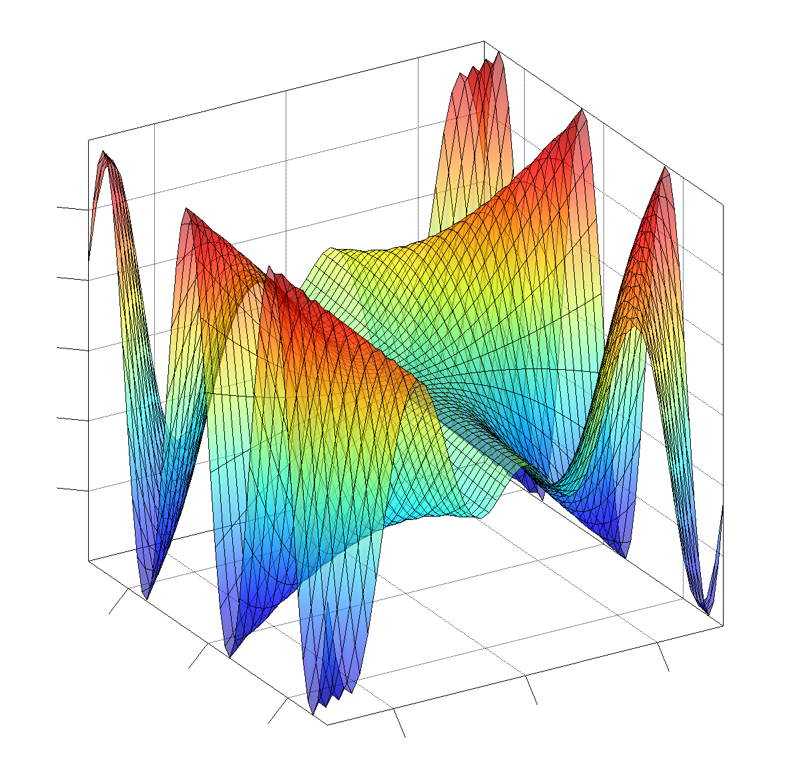
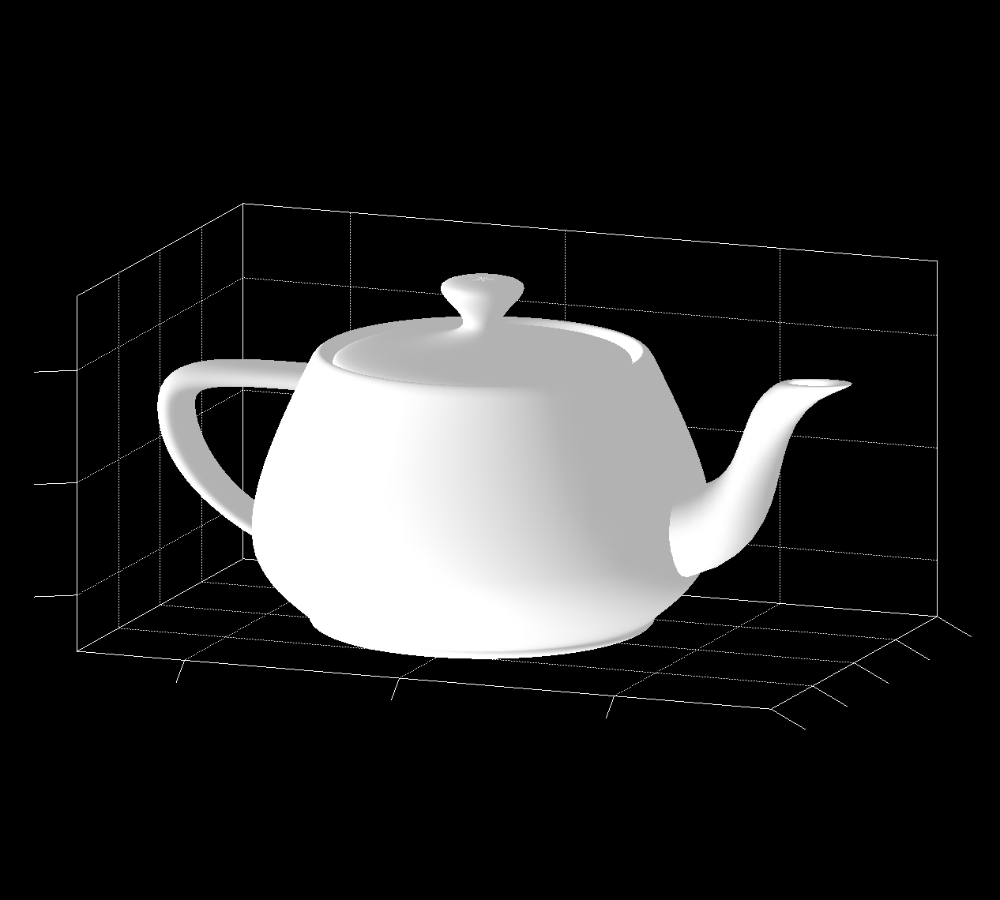
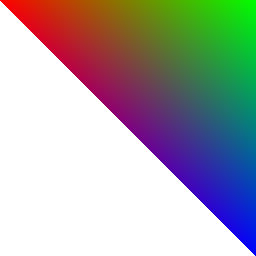

# Demos

## 3D onscreen GL demos
These two demo open a *native* window with Jzy3D (hence not a Java window yet). One can use the mouse to rotate the object, and double click to start an automatic rotation.

| `SurfaceDemoPanamaGL`| `TeapotDemoPanamaGL`|
|-|-|
|  |  |

## 3D offscreen GL demo

These two demo open an offscreen GL context to render into an image - for future onscreen usage.

| `TestFBO_macOS`| `DemoFBO_Offscreen_macOS`|
|-|-|
|  |  |

## Run onscreen demos

You need to install Panama for JDK 17 [Panama Early-Access build](https://jdk.java.net/panama/).

### Run onscreen demos from IDE

Then run from Intellij ([Eclipse won't work yet](https://github.com/jzy3d/panama-gl/issues/3)) one of these demos
* SurfaceDemoPanamaGL
* TeapotDemoPanamaGL

There is no automatic OS detection yet so you should verify if the `Painter` is the good one :

```java
ChartFactory factory = new PanamaGLChartFactory(new PanamaGLPainterFactory_MacOS_10_15_3());
//ChartFactory factory = new PanamaGLChartFactory(new PanamaGLPainterFactory_MacOS_11_4());
```

Running the program will require extra VM arguments as shown below.

##### MacOS 10.15.3
```
-XstartOnFirstThread --enable-native-access=ALL-UNNAMED --add-modules jdk.incubator.foreign -Djava.library.path=.:/System/Library/Frameworks/OpenGL.framework/Versions/Current/Libraries/
```

##### MacOS 11.4

Not working yet! Despite code is generated and integrated, still have to locate OpenGL libs.

```
-XstartOnFirstThread --enable-native-access=ALL-UNNAMED --add-modules jdk.incubator.foreign -Djava.library.path=.:/System/Library/Frameworks/OpenGL.framework/Versions/A/Libraries/
```

/opt/homebrew/Cellar/freeglut/3.2.1_1/lib

https://stackoverflow.com/questions/65802625/develop-using-opengl-4-x-on-osx-big-sur

##### Ubuntu 20

```
--enable-native-access=ALL-UNNAMED --add-modules jdk.incubator.foreign -Djava.library.path=.:/usr/lib/x86_64-linux-gnu/
```

### Run onscreen demos from CLI

##### Build

To build with Maven
```
mvn clean install
```

Note that build may be slow on compiling generated binding files (+7000 on Linux!). This will later lead to Jar split to avoid having to rebuild these parts that never change (see Design doc).

Note that Maven autodetect platform to define the path to local OpenGL java libraries.

See the main [pom.xml file](pom.xml) for more about these automatic settings if you encounter issues at this step.

If test fail, you can skip them

```
mvn install -DskipTests
```


##### Run

Check JRE is Panama
```
java -version
openjdk version "17-panama" 2021-09-14
```

Run from command line with these VM args (see below the appropriate VM args for an IDE)

```
java -XstartOnFirstThread \
    --enable-native-access=ALL-UNNAMED \
    --add-modules jdk.incubator.foreign \
    -Djava.library.path=.:/System/Library/Frameworks/OpenGL.framework/Versions/Current/Libraries/ \
    -jar target/panama-gl-2.0.1-SNAPSHOT.jar \
    Teapot
```

## Troubleshooting

An `UnsatisfiedLinkError` is thrown while invoking a bounded function.

Cause : the underlying method handle is null because the native library has not been loaded explicitely by the generated code.
This may occur if jextract is given a header file and an incomplete list of libraries.

`java: package jdk.incubator.foreign is not visible` message when running from IntelliJ.

Solution : ensure these 3 settings
- in addition to setting VM parameters in the Run Configuration
- add --add-modules jdk.incubator.foreign under Preferences -> Build, Execution, Development -> Compiler -> Java Compiler -> Additional command line parameters
- in the same window, set the target bycode version to the VM version we run on (here 17).