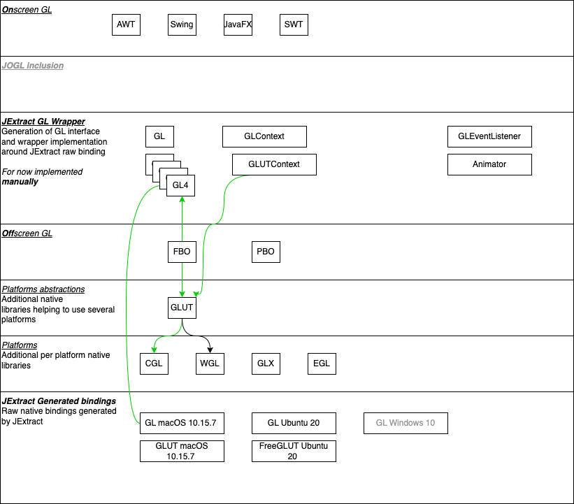

# Panama GL Design

This illustrates the various Java classes categories for Panama GL.

# Panama GL Jars

One word clarification 
* We refer to _native libraries_ when we talk about .h and .so/.dylib/.dll files compatible with a given OS version and hardware. Remains on developer computer for now - maybe later added as default artifact.
* We refer to _binding files_ when we talk about JExtract generated Java/Byte code code, able to invoke .h + native library. Their generation process is defined in [setup](setup.md).
* We refer to _wrapper files_ when we talk about per OS implementations of GL and GLContext, using binding files for their implementation. Wrapper files are either handwritten or automatically generated.

The target Jar units is

